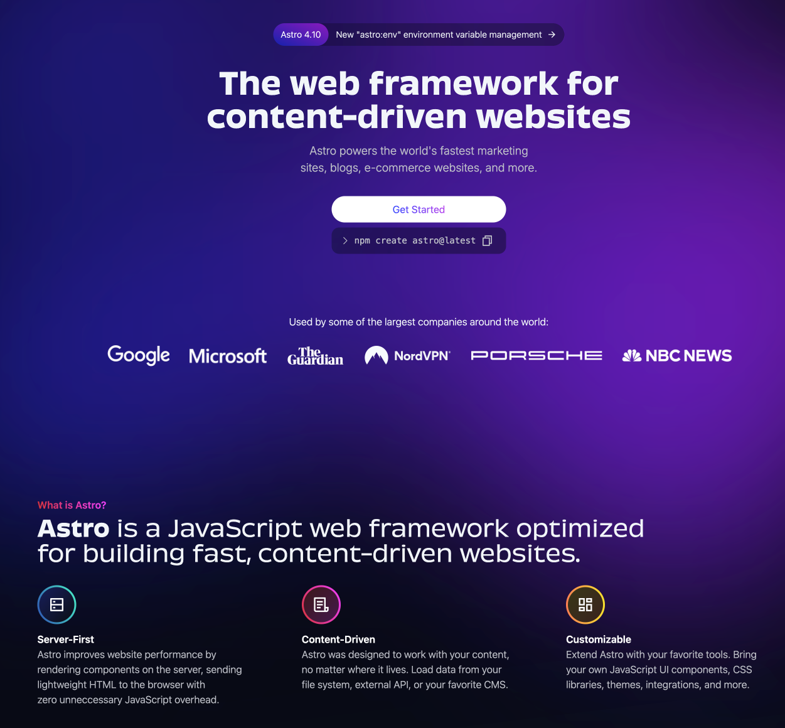

Because...

1. I like a challenge and learn new things

2. I like how fast static websites are

3. To get rid of the monthly CMS/Hosting fees but for this site, and hopefully in the near future also for the 4 CRO.CAFE podcast sites 🤞

I decided to move my website from Webflow to [Astro](https://astro.build/).

Came across Astro some months ago and since then we also built the CommerceQuest website with it (alongside the Vanilla forum) and I really like it. It's super fast, I learn a ton, and - despite not being a developer - I like working with the code and figuring things out.

## Stack

I'm basing the new system on [Astro](https://astro.build/), [Tailwind](https://tailwindcss.com/), [Keystatic](https://keystatic.com/) and [Netlify](https://www.netlify.com/).

## Archive

For the history books, the previous homepage in Webflow:

