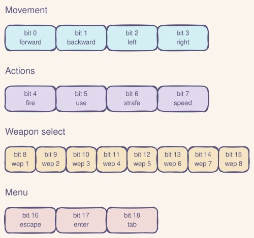

Someone ran Doom through DNS. [Adam Rice stored the entire game in TXT records](https://blog.rice.is/post/doom-over-dns/) and it actually worked. I saw that and - being at an AT Protocol conference - thought: can the AT Protocol do the same thing? Store the game and actually play it, with every player input and every rendered frame traveling through the protocol?

The answer is yes. Sorta. It plays terribly. No-one should want this. But it works. [You can try it yourself.](https://doom.singi.dev/)

Fair warning: this is a technical post. If you're here for the details, you're in the right place.

## The data flow

Every piece of data travels through AT Protocol records. The architecture is a hybrid: Jetstream for input delivery (because the player's PDS is on bsky.social), direct localhost PDS polling for frame delivery (because it's faster than waiting for the relay network to crawl a new self-hosted PDS).

When you press a key:

1. Your browser captures the keyboard event and encodes it as a bitmask
2. The client server writes that bitmask as a `dev.singi.doom.input` record to your PDS (probably bsky.social)
3. Jetstream (AT Protocol's real-time event stream) delivers that record to the game server
4. The game server queues your input and flushes it before the next tick batch
5. The Doom WASM engine ticks (5 ticks per batch), renders a frame at 320x200
6. A custom PNG encoder compresses the frame to 8-37KB
7. The game server writes that PNG as a blob-backed `dev.singi.doom.frame` record to its own self-hosted PDS
8. The client server polls the localhost PDS every 100ms for new frame records
9. It fetches the PNG blob and sends it to your browser via WebSocket
10. Your browser renders it to a canvas

Every step goes through AT Protocol records. That's the whole point (and the whole self-induced problem).

## The game engine

I'm using [doomgeneric](https://github.com/ozkl/doomgeneric), a portable C implementation of the Doom engine designed for "bring your own I/O." It exposes six callbacks that you implement yourself: init, draw frame, sleep, get ticks, get key, and set window title. Most of those are no-ops here because there's no actual display to manage.

Compiled to WebAssembly via Emscripten, the engine produces a 325KB `.wasm` file running at 320x200 resolution.

### Why it runs in a Worker thread

The WASM `doom_tick()` call is synchronous and takes 2-20ms depending on the scene complexity. That doesn't sound like much, but at the frame rates I'm targeting it would block Node.js's event loop enough to starve HTTP request handling. Running the engine in a Worker thread keeps the main thread responsive for WebSocket connections, OAuth callbacks, and frame delivery.

### Key event queuing

Key events from Jetstream arrive asynchronously while the engine may be mid-tick. Sending key events to the Worker during an active `doom_tick()` caused WASM memory corruption ("memory access out of bounds"). The fix: queue key events in the main thread and flush them to the Worker only between tick batches.

### Frame encoding

Doom renders with a 256-color palette, which is great for indexed-color PNG. Claude Code wrote a minimal PNG encoder that:

1. Scans the RGBA framebuffer for unique colors (always under 256 for Doom)
2. Builds a palette
3. Writes palette-indexed scanlines
4. Compresses with zlib deflate (level 6)

Result: 8-37KB per frame, compared to ~90KB with standard RGB PNG. Encoding takes about 5ms. The frames fit comfortably within AT Protocol blob size limits.

## Player input

The browser captures keyboard events and encodes them as a 19-bit bitmask:

| Bits | Purpose |
|------|---------|
| 0-3 | Movement: forward, backward, left, right |
| 4-7 | Actions: fire, use, strafe, speed |
| 8-15 | Weapon selection (8 slots) |
| 16-18 | Menu: escape, enter, tab |

Key state changes (not every keypress) are batched and written to the player's PDS as `dev.singi.doom.input` records every 500ms. That keeps the write rate at ~2 records/sec.

The game server subscribes to those input records via Jetstream, diffs each bitmask against the previous state to generate press/release events, and queues them for the next tick batch.

### Stale event filtering

Jetstream replays events from its buffer on reconnection. Without filtering, old input records from previous sessions would replay, navigating through menus and starting games automatically. Both the server (inputs) and client (frames) skip any event with a `createdAt` timestamp older than 10 seconds.

## Authentication

Players authenticate via AT Protocol OAuth with granular scopes. The consent screen only asks for permission to write `dev.singi.doom.input` records. No access to your posts, profile, or DMs. If a PDS doesn't support granular scopes, the client falls back to `transition:generic`.

The OAuth keypair is persisted to disk so it survives container restarts. Without persistence, each restart generates a new key, but the player's PDS caches the old JWKS, causing "invalid_client" errors until the cache expires.

The game server itself uses an app password on its self-hosted PDS, so no OAuth needed for server-to-PDS writes on localhost.

## Why a self-hosted PDS

Early versions wrote frame records to bsky.social, which has rate limits: 5,000 write points per hour, with each record creation costing 3 points. Quick math: at just 2 frames per second, that's 6 points per second, 360 per minute, 21,600 per hour. You blow through the hourly limit in about 14 minutes.

And on top of the documented limits, there's undocumented anti-abuse throttling. One test session wrote 1,664 records in 2 minutes and locked the account for over 12 hours, well beyond the documented rate limit windows.

I now also cycle through multiple game bot accounts, automatically switching when one approached its rate limit budget. Only needed if some wacko plays this for over 45 minutes so I think we're ok.

This runs on a dedicated Hetzner CX23 VPS running a self-hosted AT Protocol PDS alongside the game engine. Frame writes go to `localhost:3000` with near-zero latency and no rate limits. The PDS federates with the AT Protocol network via `plc.directory` for identity resolution.

This is arguably the architecturally correct setup anyway. The game server is the authority on frame data, so it should host that data on its own PDS. Federation at work!

## Jetstream and the hybrid architecture

The first implementation used `listRecords` polling every 200ms for everything. Three problems:

1. **Record ordering was wrong.** TIDs (AT Protocol's timestamp-based IDs) sort differently than I expected, so records arrived out of order.
2. **Wasted API calls.** Polling burns requests even when nothing changed.
3. **Latency floor.** 200ms minimum, no matter what.

Switching to Jetstream for input delivery solved all three. It's the AT Protocol's real-time event firehose, delivered over WebSocket. Events arrive within ~50-200ms of record creation. The server subscribes filtered by the player's DID and the `dev.singi.doom.input` collection.

But: frame delivery went *back* to polling. A newly self-hosted PDS needs to be crawled by the relay network before Jetstream sees its events, and that can take minutes or fail silently. Since the game server and client run on the same machine as the PDS, polling localhost at 100ms is actually faster than waiting for relay propagation.

So the final architecture is a pragmatic hybrid: Jetstream where it's the only option (cross-PDS input delivery from bsky.social), direct PDS polling where it's faster (same-machine frame delivery).

Jetstream might be one of the most underappreciated pieces of AT Protocol infrastructure. It's a general-purpose real-time event system that works for any application built on AT Protocol records. It's what got this from "completely unplayable" to "technically playable". If you're generous with the word "playable"...

## The lexicons

Five custom lexicons define the game's data schema:

| Lexicon                   | Purpose                                                         |
| ------------------------- | --------------------------------------------------------------- |
| `dev.singi.doom.defs`     | Shared types: key bitmask, frame metadata, encoding tokens      |
| `dev.singi.doom.session`  | Game session metadata: WAD, player DID, status, tick rate       |
| `dev.singi.doom.input`    | Player input: array of key bitmasks per record                  |
| `dev.singi.doom.frame`    | Rendered frame: PNG blob reference, dimensions, sequence number |
| `dev.singi.doom.artifact` | Game asset storage for chunked blobs (the "DNS mode")           |

The `artifact` lexicon enables a second mode inspired directly by the DNS project: store the entire Doom WAD and engine as chunked blobs on a PDS, fetch them, and run locally. The AT Protocol equivalent of Adam Rice's 2,000 DNS TXT records, except you only need about 5 blob records.

## Performance and bottlenecks

Here's where the latency lives:

| Step | Time |
|------|------|
| WASM tick | 2-20ms |
| PNG encode | ~5ms |
| PDS write (localhost) | ~5-20ms |
| Localhost frame poll interval | 100ms |
| Jetstream input delivery | ~50-200ms |
| **Full round-trip (input to frame)** | **~200-500ms** |

| Metric | Value |
|--------|-------|
| Visible FPS | 5-15 (varies with Jetstream latency) |
| Game ticks per write batch | 5 |
| Write interval | 500ms |

The bottleneck is Jetstream propagation on the input path (~50-200ms). Frame delivery is fast now that it polls localhost directly instead of waiting for relay propagation. The WASM engine and PNG encoding are negligible.

### What would it take for higher framerates?

Not much you can do within the protocol constraints.

The frame delivery side is already fast (localhost polling at 100ms). The remaining bottleneck is Jetstream input delivery (~50-200ms), which you can't eliminate because the player's PDS is on some remote PDS (e.g. bsky.social).

Some things that could help:

- **Colocating with a Jetstream endpoint** could shave network latency off the input hop.
- **Running your own relay** would remove the relay hop entirely, but at that point you're basically building a direct connection with extra steps.
- **Predictive rendering on the client** could mask latency by running the engine locally and reconciling with server frames when they arrive. Possible, but complicated.

The realistic ceiling is probably ~15-20fps with favorable Jetstream latency. For comparison, a direct WebSocket between client and server would give 60fps easily. But doing that defeats the entire point of the project.

## What I learned

**AT Protocol is very flexible.** Custom lexicons, blob storage, OAuth with granular scopes, federation... the building blocks for applications far beyond social media are already there. I'm building [Barazo](https://barazo.com) and [Sifa ID](https://sifa.id) as serious projects on the protocol. This was the fun side project that showed me how much room there is to experiment.

**Self-host your PDS if you're building anything non-trivial.** The AT Protocol is designed for federation. Running your own PDS isn't just about avoiding rate limits, it's about being the authority for your data. The game server produces frame data, so it should host that data on its own PDS. This also eliminates dependency on relay crawling delays.

**Jetstream deserves more attention.** Any application built on AT Protocol records can use it for real-time event delivery. Feed generation is the obvious use case, but it works for anything. And it's what makes this game "playable".

**Rate limits are the real boss.** The hardest part wasn't the WASM engine or the protocol integration. It was staying within bsky.social's rate limits for both the server and the user PDS. The documented limits (5,000 points/hour) are only part of the story: there's also undocumented anti-abuse throttling that can lock accounts after burst writes.

**WASM engines are surprisingly fragile at high tick rates.** The doomgeneric WASM engine crashes with memory access violations when key events are sent mid-tick or when tick rates exceed what the engine expects. Careful sequencing (queue events, flush before tick, await completion) is the only thing that works reliably.

Also: DO NOT use your main account/PDS for testing. I got rate-limited for 12 hours and couldn't use my account during #ATmosphereConf. Not ideal.

## Stack

- **Game engine**: doomgeneric, compiled to WebAssembly via Emscripten (320x200, 325KB)
- **Runtime**: Node.js 22, TypeScript, pnpm monorepo
- **AT Protocol**: @atproto/api, @atproto/oauth-client-node, Jetstream
- **PDS**: Official Bluesky PDS 0.4 (self-hosted, Docker)
- **Deployment**: Hetzner CX23 VPS, Caddy, Docker Compose

---

What else would you build on the AT Protocol that isn't social media? I'm curious what other "deliberate misuse" projects people come up with.

Try it: [doom.singi.dev](https://doom.singi.dev/)
