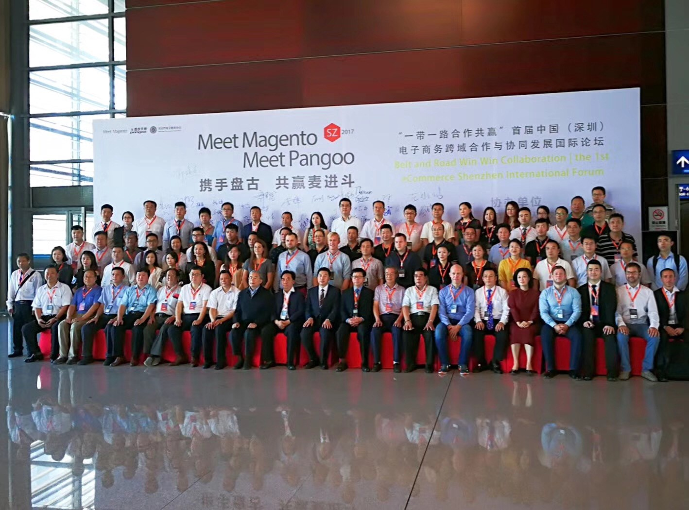

1. You need WeChat for basically everything and it’s quite impressive what you can do with it (translations, payments, taxi, bicycle rent, movie tickets, hotel bookings, pay for your utilities,…).

2. QR codes are actually a (big) thing here.

3. Merchants want to move away from Alibaba. There is so much competitions on the marketplace and no way to present your own brand differently in ways that matter.

4. Factories are moving away from Shenzhen because employees are getting too expensive and less and less employees are available in Shenzhen.

5. Good software engineers or MBAs get paid much more in Shenzhen than in Silicon Valley.

6. People are accustomed to shipping taking around 3 days.

7. Besides culture, the language barrier itself is already quite a tough bridge to cross, even with translators. It’s definitely improving: younger people (\< 30) often had English in their education, but often not much real practice actually communicating with foreigners. Which makes them hesitant/shy to try speaking English. I have the same with German and French.

8. If you want to start selling in China, having an existing western or worldwide brand will give you an advantage. China might be known for copycats, but most people do recognize and prefer real brands.

9. China is working on IP regulations. This means that the copycat business might be getting more and more restricted.

10. CRM/Customer retention doesn’t seem to be a thing: business focus on, it’s all about getting to that single sale and move to the next customer.

11. Besides a power adapter, bring a VGA adapter.

12. People in Shenzhen work insane days and start early in the morning. Which means that after 21/22h, all social activities will be done and the streets get empty quickly.

13. If you are 1.86m/6.1ft and have blond hair: no-one will miss you (that’s for all of Asia by the way).

14. the social events (dinner mainly) after/before the conference are more important than the conference itself even more so than in western countries.

15. [Kuba Zwoliński](https://medium.com/@kubazwolinski) tought us this: If invited to dinner, you should start eating as soon as the food hits the table. The host will probably invite you for rounds and rounds of toasts with rice wine (18%–25%). Since you’ll be standing up for each toast, it’s good to slow the alcohol absorption with the food asap to make sure that after 2 hours you still can actually stand up… ;)

16. Getting into Shenzhen is quite easy. No need to arrange visa up-front, you can apply for 5 day visa at the border. It will most likely cost you 168 RMB (€21.60/$25.61).

