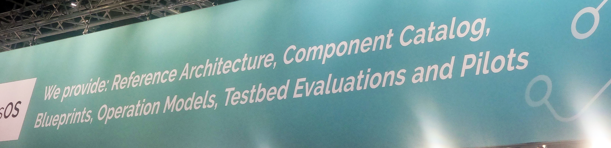

Conferences are chaotic: At major trade fairs like the Hannover Messe, where nearly 4,000 exhibitors vie for the attention of 130,000 visitors, standing out is crucial. As a visitor, it's overwhelming; as an exhibitor, it's pivotal to get into contact with prospects.

The primary goal for an exhibitor is to catch the eye of the right visitor and (next step) engage them in meaningful conversation.

A flashy stand can help in catching that visitor, but that person walking by only has a couple of seconds to decide if you have a potential solution to their business challenge.

Your logo and company name (probably) don't do that. Unless you are a well known brand, your name/logo means nothing to the uninitiated. So please don't make that the biggest item on your banners.

Two options left:

1. **Show your product**
2. **Have a great tagline**

\#1 is great if you have physical products but a lot harder when you sell services of software. Which leads me to #2.

Many companies in this category completely miss the mark when it comes to booth messaging and for some reason use overly generic and ambiguous taglines such as (these directly come from the booths this week):

- **"Intuition engineered"** – Too abstract, lacks indication of practical application or industry relevance.
- **"From change to value faster"** – Vague; fails to specify the type of change or the nature of the value.
- **"Accelerate your business with AI"** – Broad and nonspecific; doesn't explain how AI will be utilized to accelerate the business.
- **"Innovation never ends"** – Generic; could apply to any company in any sector, does not highlight unique aspects.
- **"Enable the change"** – Vague; change in what context? Does not specify the industry or the type of services offered.
- **"Business. People. Technology."** – Overly broad; reads as a list of concepts without connecting them to a specific offering or outcome.

**Wut?** 🤷‍♂️

All these taglines fail to communicate what these companies actually do and why you as a visitor should engage with them. Basically every exhibitor could use any of these taglines and no-one would notice.

## Consequence of Vague Messaging

The danger of vague messaging is twofold:

1. Potential clients can easily bypass your booth for lack of understanding of what's offered
2. You might end up engaging the wrong audience, wasting valuable time and resources from both you and the visitor.

## Examples of (more) Effective Taglines

Conversely, some exhibitors had much clearer (or at least targeted) taglines, such as:

- **PLM solutions for engineering & Manufacturing**
- **All on one CAx solution provider**
- **Industrial cybersecurity and OT protection**
- **Industrial DataOps at scale**
- **Next level MES for Discrete and Process Industries**
- **The digital product passport for industry 4.0**

Yes it's long. It's also very descriptive in what they offer!

These examples successfully speak directly to their intended audience, eliminating any guesswork about the services provided. For some of these I have no idea what they mean, but this is great because then I know I'm not the right audience for them and I won't be wasting my own or their time! 😄

## Lesson from... the Food Trucks?!

The clearest messaging lessons came from an unexpected place: the fair's food court. Walking outside was literally a breath of fresh air with seeing straightforward signs like "Grill," "Falafel Time," and "Burger Shop,". There’s zero ambiguity on what they're selling. Visitors know exactly what each vendor offers, enabling quick and easy decisions.

<iframe
  width="560"
  height="315"
  src="https://www.youtube.com/embed/gjoAm4RjSr8"
  title="YouTube video player"
  frameborder="0"
  allow="accelerometer; autoplay; clipboard-write; encrypted-media; gyroscope; picture-in-picture; web-share"
  allowfullscreen
></iframe>

Can you imagine Food Trucks using taglines like...

- **"Food engineered"**
- **"Your food partner"**
- **"Food that makes the difference"**
- **"People. Ingredients. Food."**

You'd have no idea what they would actually sell! 😄

## Ready to stand out?

If you're not fully on board yet, challenge yourself and run an experiment! For half of your trade shows, use direct, jargon-free messaging, just like our food truck example. For the other half, stick to your usual strategy. Track engagement levels, gather feedback, and see which approach drives more qualified leads.

Let's be at least as good as the food trucks. Who's in?
