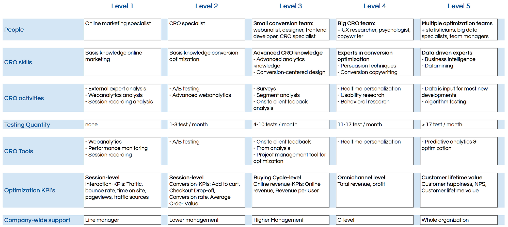
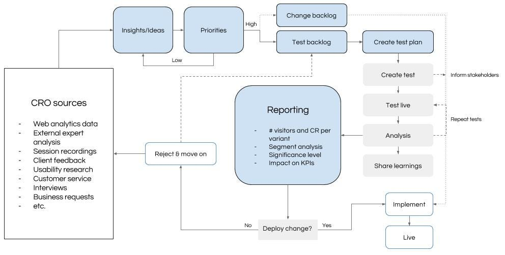
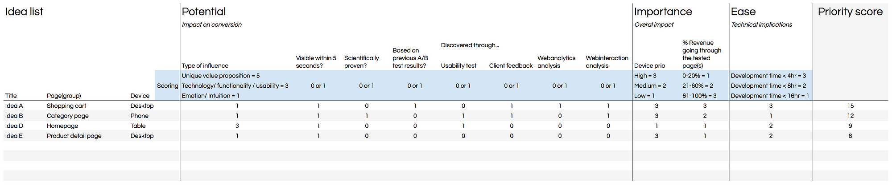
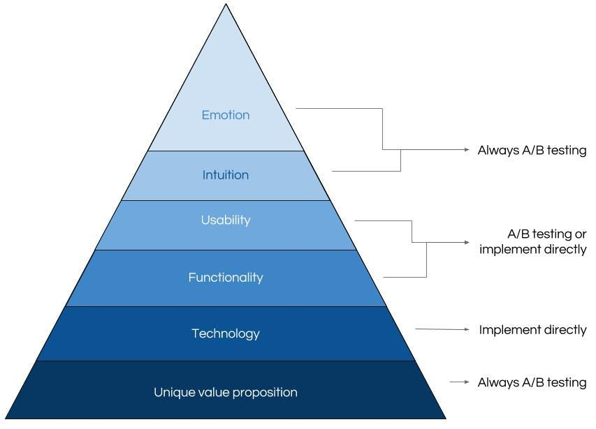

Every year, the (Dutch) Shopping Tomorrow initiative brings together a large group subject matter experts (450 this year) to tackle specific business challenges about — you guessed it — how consumers are shopping in the near future (tackling both online and offline).

In 2016 I was part of the ‘Revenue Optimization’ group for the second time. Together with 18 other experts improved on the process of optimizing on-site revenue that we first created in 2015.

Here I'd like to share the main findings that we published in our (Dutch) whitepaper (the original PDF is no longer available online).

_Also see my next article: [Proving the monetary value of A/B testing](/post/proving-the-monetary-value-of-a-b-testing/)._

### **CRO Maturity**

We created a model to see where you stand regarding conversion optimization in your company. We defined 7 area’s that can be scored on a scale from 1–5:

1. People

2. CRO skills

3. CRO activities

4. Testing Quantity

5. CRO Tools

6. Optimization KPI’s

7. Company-wide support

The table below gives you a global idea of the different levels for each:

_\[The full table was previously available as a Google Spreadsheet, but is no longer online]_

### **CRO Cycle**

So ok, nice to know the competencies you need and where you stand right now, but how does the process itself look like?

Well, according to it will (basically) look like this for all companies on Level 2–5:

_\[See full scheme in the image above]_

CRO Priority

So when you have your list of ideas, where do you start? How do you prioritize?

For this we made combination of the PIE (Potential Importance Ease) model and the ConversionXL (PXL).

_\[The prioritization spreadsheet was previously available as a Google Spreadsheet, but is no longer online]_

If prioritizing your testing ideas is an issue for you, I’d highly recommend reading [4 Frameworks To Help Prioritize & Conduct Your Conversion Testing](https://conversionxl.com/4-frameworks-help-prioritize-conduct-conversion-testing/).

### **What to test and what to implement directly?**

Looking at the CRO version of Maslovs piramid, we made the following choices:

For example: if you find a SSL security issue during a usability test, you’re not going to A/B test how that impacts conversion: you just implement it. But when there are issues with usability of functionality, it depends on the issue if you want to test it or implement it directly.

### **Final take-aways from the expert group**

1. Create your list of potential improvements always on basis of (qualitative or quantitative) data instead of gut feeling

2. Also use data to prioritize your list in order to get maximum impact in your KPIs with minimum effort

3. Validate potential improvements through A/B testing and setup processes to continuously learn from your target audience.

The complete presentation and cases were previously available on SlideShare (in Dutch), but the link is no longer active.

Hope this is useful to you, if you have any specific questions about the Dutch resources I linked to, let me know :).
