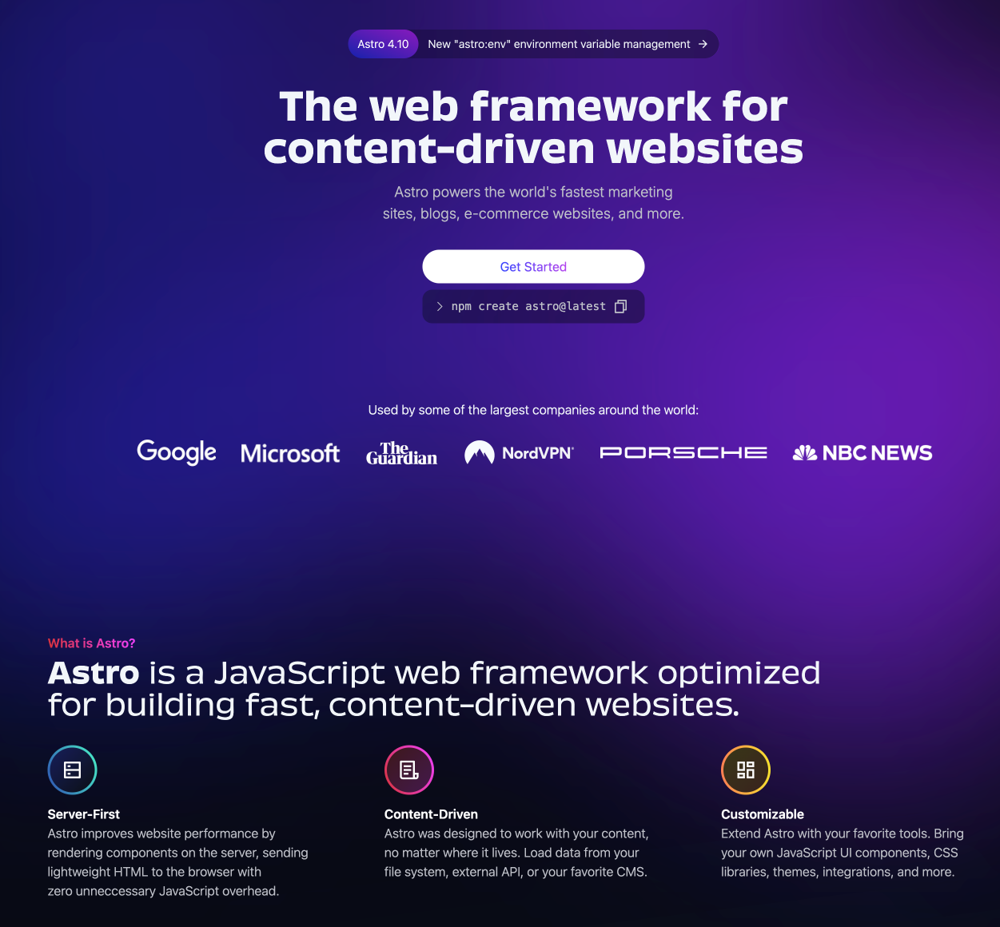

Because...

1. I like a challenge and learn new things 🤷
2. I like how fast static websites are 🏎️
3. To get rid of the monthly CMS/Hosting fees for the sites I host, hopefully in the near future including the 4 CRO.CAFE podcast sites 🤞

After playing around with different systems, I decided to move my website from Webflow to [Astro](https://astro.build/).

Came across Astro some months ago and since then we also built the [CommerceQuest](https://commercequest.space/) website with it (alongside the Vanilla forum) and I really like it.

* It's a static website generator. In general, that has some benefits over more database driven websites, e.g.:
  * **Speed**: Faster loading and response times due to pre-built pages.
  * **Reliability**: More stable with fewer potential points of failure.
  * **Security**: Reduced vulnerabilities without databases or server-side processing.
  * **Hosting**: Easy to deploy and scale, handles high traffic well.
  * **Maintenance**: Simpler updates, typically just editing HTML or Mardkown files.
  * **Cost**: More economical to develop and host due to lower resource needs.
* Astro resizes and compresses images automatically based on what the page requires;
* Their islands concept makes so much sense (static by default, interactive where needed);
* Great documentation;
* Active community;
* Fully Git based, so good history and rollback options;
* I learn a ton, and - despite not being a developer - I like working with code and figuring out new technologies, which is even easier nowadays with tools like GitHub CoPilot and Claude.

## Stack

I'm basing the new system on [Astro](https://astro.build/), [Tailwind](https://tailwindcss.com/), [Keystatic](https://keystatic.com/) and [Netlify](https://www.netlify.com/).

## Archive

For the history books, the previous homepage in Webflow:

